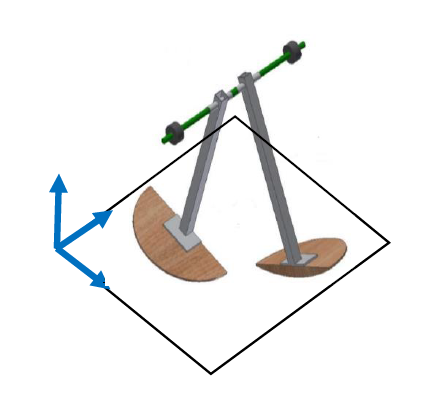

# Dinamica_Avanzada-202320
This repository contains all the files for exams for the Dinamica Avanzada course for the 2023-20 semester in Universidad de los Andes

## Problem
The exams are about the dynamics of a Passive Walker with Hemispherical feet (like in the image below). Each exam treats a part of the problem.

## Exam 1 - Kinematics
In this exam, the kinematics involving the passive walker is considered going throug the definition of coordinates systems, rotation matices, angular velocities and accelerations, and the velocities and accelerations of some points.  